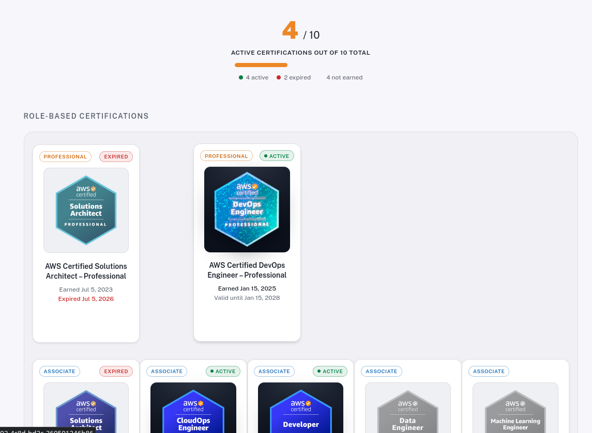
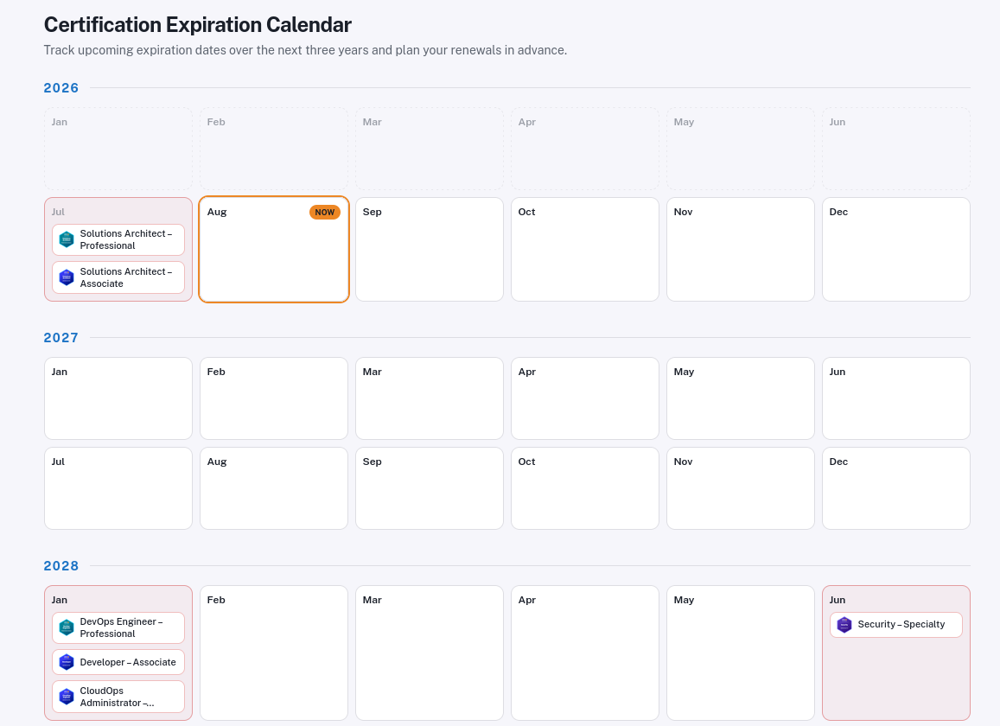

# AWS Certification Map

A static portfolio page that displays AWS certification, automatically
matched against badges earned on [Credly](https://credly.com). It shows which
certifications are active, expired, or still missing, and shows an expiration
calendar to plan renewals.

## Try the live demo

Try the interactive demo at [awscertsdemo.pusi77.eu.org](https://awscertsdemo.pusi77.eu.org/).
Enter any public Credly username to preview the certification map and expiration calendar.

### Features

Shiny badge cards with certification status, issue date, expiration date, and Credly links.




Three-year expiration calendar with the current month and upcoming renewals highlighted.



## How it works

Two operating modes:

| Mode | `CREDLY_USERNAME` | Behavior |
|---|---|---|
| Portfolio (static) | set | Page pre-rendered with your badges at build time |
| Demo (interactive) | empty | Visitors can enter any Credly username; fetches happen client-side through the `/api/credly` proxy |

The demo mode proxy lives in `functions/api/credly.js` (a Cloudflare Pages
function) because Credly's API doesn't allow cross-origin requests from the
browser. The standalone `functions/credly.js` is a CORS-enabled variant of the
same proxy.

## Configuration

### Set your Credly username

Set `CREDLY_USERNAME` in the build environment to generate a static portfolio
for that Credly profile:

```bash
CREDLY_USERNAME=your-credly-username bun run build
```

The value is read from `process.env.CREDLY_USERNAME` at build time. On
Cloudflare Pages, add `CREDLY_USERNAME` as an environment variable in the
project's build settings.

For a personal static deployment, you can also hardcode the username in
`lib/config.ts` 

Leave the environment variable unset or the hardcoded value empty to keep
interactive demo mode.

Your username is the part in your public profile URL:
`https://www.credly.com/users/<username>/badges`.


## Building

```bash
bun install
bun run build
```

Output is a fully static site in `out/`. There is no server runtime; badge data
is baked in at build time, so rebuild whenever you earn a new certification.

## Self-hosting

The `out/` directory can be served by any static file server.

### Any static host (nginx, Caddy, S3, GitHub Pages, ...)

```bash
bun run build
# serve out/ however you like, e.g.:
cd out && bunx serve .
```

Example nginx snippet:

```nginx
server {
    listen 80;
    server_name certs.example.com;
    root /var/www/aws-certification-map/out;
    try_files $uri $uri/ /index.html;
}
```

### Cloudflare Pages

Deploy the repo root; `cloudflare-pages.toml` is already configured:

```toml
[build]
command = "bun install && bun run build"
directory = "out"
functions = "./functions"
```

The Pages Functions (`functions/`) are only required for demo mode; they are
ignored when `CREDLY_USERNAME` is set. Static hosting works without them.

### Refreshing badge data

Because pages are pre-rendered at build time, badge data only updates when you
rebuild and redeploy. For frequent updates, either run a scheduled rebuild
(e.g. a cron job or a Pages scheduled function) or clear `CREDLY_USERNAME` to
enable demo mode, where data is fetched live per visitor.

